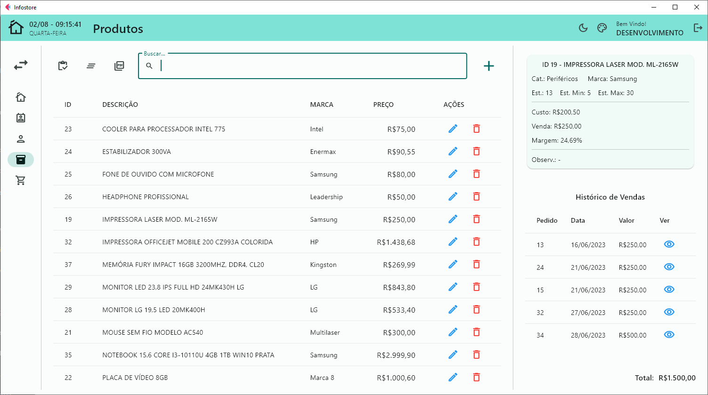

# App-With-Flet

## Descrição
O projeto foi desenvolvido com o objetivo de estudar e praticar programação em Python, manipulação de banco de dados MySQL e Flet para criação de interfaces gráficas. A ideia era criar uma aplicação que permitisse gerenciar cadastro de usuários, clientes, produtos, vendas e controlar o estoque de forma simples e eficiente.

## Funcionalidades
- Autenticação de Usuário: O sistema possui uma tela de login para autenticação de usuários administradores.
- Cadastro de Usuários: Permite a criação usuários.
- Controle de Clientes: Permite cadastrar e editar informações de clientes.
- Gerenciamento de Produtos: Possibilita cadastrar, editar e excluir produtos do estoque.
- Registro de Vendas: Permite registrar vendas, associando os clientes e produtos envolvidos.
- Controle de Estoque: Mantém atualizado o estoque de produtos com base nas vendas realizadas.

## Tecnologias Utilizadas
- Python
- MySQL
- Flet (interface gráfica)

## Telas:

Login:

Tela Inicial:

Vendas:

Produtos:

Clientes:

Cadastro de Usuários:

## Para testar:
Para executar a aplicação, certifique-se de ter o Python e o MySQL instalados no seu sistema. Além disso, é recomendado criar um ambiente virtual para isolar as dependências do projeto.

1. Clone o repositório em sua máquina local:
   - git clone https://github.com/HelioCard/App-With-Flet.git
   - cd App-With-Flet

2. Instale as dependências do projeto:
   - pip install -r requirements.txt

3. Acesse o MySQL. Crie seu banco de dados (schema) e execute o script da pasta "database_scripts" para criação das tabelas. Há duas opções:
   - create_tables - structure_only.sql (somente criação das tabelas);
   - create_tables - structure_and_some_data.sql (criação das tabelas e inserção de alguns dados para teste)

4. Execute o arquivo main.py. Digite qualquer texto nos campos "Usuário" e "Senha" e clique em "Login" para abrir a tela de configuração inicial do banco de dados. Insira seus dados de conexão e clique em "Salvar". As seguintes telas só abrem na primeira execução, quando ainda não houve configuração:

5. Mais uma vez, digite qualquer texto nos campos "Usuário" e "Senha" e clique em "Login" para abrir a tela do cadastro de administrador. Preencha e clique em "Cadastrar":
   

6. Faça o Login.

O projeto foi desenvolvido com fins educacionais e para desenvolver habilidades em Python, MySQL e Flet. Sinta-se à vontade para explorar o código e adaptá-lo às suas necessidades. Caso tenha alguma dúvida ou sugestão, entre em contato: helio.card@yahoo.com.br
